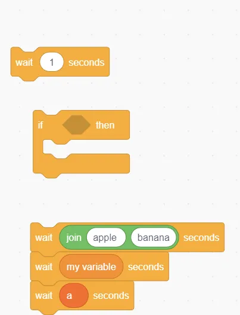

<center style="color: gray">摄影 | 大帝</center>

众所周知，Scratch 是图形化编程的鼻祖。

但是“图形化”也就意味着它不像传统编程一样使用代码来保存程序。那么 Scratch 是怎么保存我的程序的呢？

所有玩过 Scratch 的人都知道，如果你点保存，电脑上就会多出一个`.sb3`文件（Scratch 3.0）。

不过什么是`.sb3`文件？它又是什么原理呢？

## 打开一个 .sb3 文件

我们不妨写一个最简单的 Scratch 项目，方便我们的研究：


好啦！这个项目只有一个角色，一段程序。那么接下来，我们就可以把它“拆开”了。

虽然 Scratch 项目的文件后缀是`.sb3`，但是它的格式却是`zip`格式。不信的话，你把文件名改成`project.zip`试试？

改完后缀再一解压，我们发现在这个 zip 包中有下面几个名称很诡异的文件：


不过，通过他们的**文件后缀**和**图标**，我们可以知道：
- 前两个是音频文件（`.wav`）
- 中间三个是图象文件（`.svg`）
- 最后一个是`json`格式的文件

前五个都是资源文件，那我们的程序存储在哪里呢？
很明显，我们的程序就存储在`project.json`中。

## "project.json"
打开我们的`project.json`
（懒得动手点这个：[https://jsonhero.io/j/aLa9Pdplt8O8](https://jsonhero.io/j/aLa9Pdplt8O8)）
，我们发现这个 json 文件的第一级只有四个字段：


中间两个是空的，最后一个是`meta`，存放的是版本信息。所以我们的程序一定存储在`targets`里面。

**`targets`很关键。它存储着*每一个* `Scratch 角色`的信息。
包括那个 “形似糖葫芦” 的角色、我们写的程序，甚至还包括舞台。
（嗯，在 Scratch 中，舞台其实也是一个角色）**

那么`targets`有两项也就不难理解了：
一个是那个“糖葫芦”，
另一个是舞台。

`targets`中的每一个`角色`都包含一堆属性，看名字都能猜出什么意思。比如：`isStage`是不是舞台；`name`角色的名称；`volume`音量 等等。有兴趣的可以自己看看。


## 那么我们的代码究竟在哪？

请看我选中的`blocks`字段。<del>（可算完了）</del>

我们都知道，在 Scratch 中，你可以拖动一个一个的 “积木” 来给角色编程，比如`移动10步`、`右转15度`。
这些 “积木” 的英文就叫做`block`。

你每拖动一个`block`，其实就是把这个 block 和它相关的参数添加到`blocks`这个列表中。

所以通过查看 `blocks` 这个列表，我们就能知道这个程序的逻辑。

## blocks
打开 blocks 一看，里面分别有 `a`, `b`, `c`三个东西。这分别对应我们程序的三个 `block`。而 a, b, c 则分别是这三个 block 的 `id`（唯一标识符）。

以`id`为索引是有用处的。我们接下来讲到这一点，你就会感叹设计者的神奇脑回路。

我们先来看看`a`长什么样：

```json
{
  "opcode": "motion_movesteps",
  "next": "c",
  "parent": "b",
  "inputs": {
    "STEPS": [
      1,
      [
        4,
        "10"
      ]
    ]
  },
  "fields": {},
  "shadow": false,
  "topLevel": false
}
```

原来`a`也有一堆属性：
- `opcode(指令)`：这个积木是干啥的？移动还是旋转？`opcode`能告诉你答案。比如说这个"motion_movesteps"就是`移动n步`这个积木。
- `next`：下一个积木是什么？这里的 "c" 是 c 积木的 `id`。因为`blocks`的索引是 “积木 id”，所以通过 "c" 就能很快速地找到下一个积木。
- `parent`：这个积木的 “父对象” 是什么？<del>是妈妈</del> 
1. 一般情况下，一个积木的 “父对象” 就是它上面那个积木，与 "next" 相反。
2. **但是如果一个积木 “嵌入” 在诸如`if`之类的语句中，那么它的父对象就是`if`。**
- `inputs` & `fields`：这俩是你的输入。比如说 “移动10步”，我们通过`opcode`能知道具体是哪个积木——“移动n步”。**但是移动几步呢？** Scratch 有一个输入框：“移动`__`步” 。你可以输入任意步数，那么你输入的数字就在`inputs`里面。（如果是一个下拉菜单，那么就会存在`fields`里面，本质上他俩都是输入）
- `shadow`：这个积木需不需要默认值？你如果不填那个 “移动`__`步” 的输入框，程序还想正常运行，怎么办？
Scratch 会为每个参数设置默认值。当你不填的时候，`shadow`就会被激活，你不填的那个参数就会自动变成默认值。
- `topLevel`：这个积木的上方有没有连接积木？Scratch 的积木有几种形状：
1. 绿旗这类 “触发器积木” 上面不能加其他积木，**他们的`topLevel`*一定是 true***。
2. “移动” 这类积木，上下都可以连接其他积木。那么只有在他们**上面不连接积木**时，其`topLevel`才会是 true。**他们的`topLevel` *不一定是 true***。

特别地，当一个积木是`topLevel`时，他还会有`x`和`y`两个参数，用于标记这一列积木到底在哪个位置。这样你每次重新打开的时候，积木就总会在同一个位置。

看晕了吗？Scratch 的核心就这些东西，难度肯定是有的。不过你看懂之后就无敌了。

## 奇怪的 inputs
慢着，上面的 `inputs`怎么这么奇怪？
```json
  "inputs": {
    "STEPS": [
      1,
      [
        4,
        "10"
      ]
    ]
  },
```
这是个啥啊，丑死了！

别着急，我们一点一点往下看。

首先是这个 `"STEPS"`。
刚刚我们说了，inputs 里面是你填的参数：移动几步、旋转几度……
那么 `"STEPS"` 很容易理解，就是关于到底移动几步的参数。

STEPS 是一个列表，第一项是 1 ，第二项又是一个列表。

其中关于`1`这个位置的数字有特殊含义，稍后会讲到。先给出对照表：
|数字|意思|
|---|---|
|1|这是一个有 shadow（默认值）的 “填空题”|
|2|该参数没有默认值|
|3|“填空题”。但是填了一个积木，而不是输入|

1、2、3 分别对应如图所示的几种 Scratch Block：




ok 这是一个填空题。那下边一个列表又是什么意思呢？

我们看到了 "10"。很明显，这就是我填的东西。

请注意，`"10"` 是一个`字符串`，但是 “移动10步” 中的参数 10 显然应该是一个 `数字`。

问题就来了：一个填空题，它可以填`文字`、`数字`、`日期`，甚至还能填`变量`。有些东西 json 提供了，比如说 `String`和`Number`，但是有些东西 json 没提供，比如说 Scratch 变量。

所以我就需要自己创造一个统一的格式，能够表示 Scratch 中的所有数据类型。

不知道你是怎么想的，反正 Scratch 选择了列表。

刚刚那个 `1`，现在的`4`，都是 Scratch 自己的统一格式，用来告诉你接下来的东西是哪种类型的数据：`文字`、`数字`、`变量`或者更多。

这是有一个表的，记录了这种神奇数字和 Scratch 所有数据类型的对应关系：


以后遇到这种数字，查个表就知道了。

## 完了
完了？完了。

只是说，如果你想要看更详细的有关`.sb3`文件格式的内容，可以去这个网站：[https://en.scratch-wiki.info/wiki/Scratch_File_Format](https://en.scratch-wiki.info/wiki/Scratch_File_Format)

祝你们在探索 Scratch 的路上 <del>一路走好</del> 一帆风顺~
